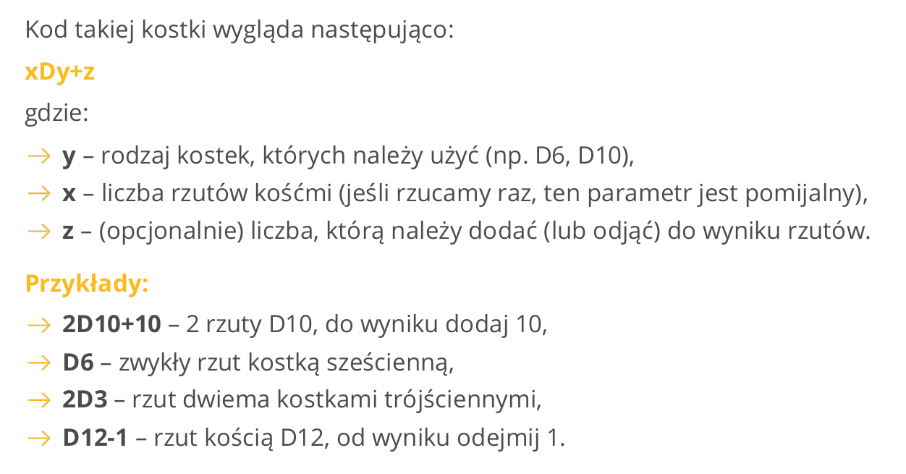
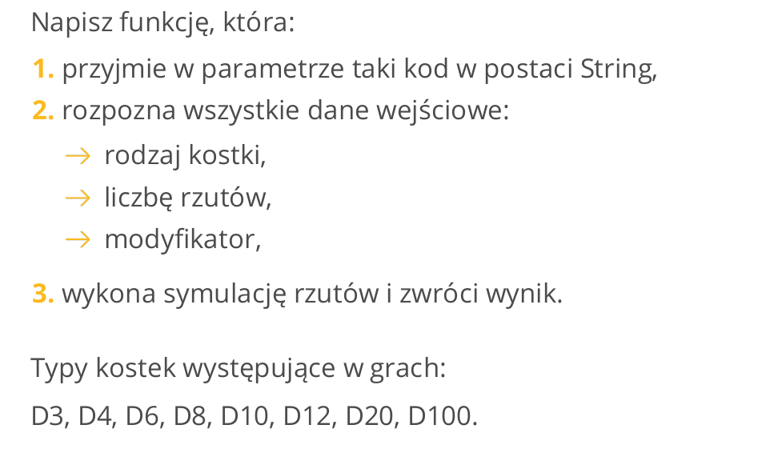

# Warsztaty 1

## Gra w zgadywanie liczb
Napisz prostą grę w zgadywanie liczb. Komputer ma wylosować liczbę w zakresie od 1 do 100.
Następnie:
1) wypisać: "Zgadnij liczbę" i pobrać liczbę z klawiatury;
2) sprawdzić, czy wprowadzony napis, to rzeczywiście liczba i w razie błędu wyświetlić komunikat: "To
nie jest liczba", po czym wrócić do pkt. 1;
3) jeśli liczba podana przez użytkownika jest mniejsza niż wylosowana, wyświetlić komunikat: "Za
mało!", po czym wrócić do pkt. 1;
4) jeśli liczba podana przez użytkownika jest większa niż wylosowana, wyświetlić komunikat: "Za
dużo!", po czym wrócić do pkt. 1;
5) jeśli liczba podana przez użytkownika jest równa wylosowanej, wyświetlić komunikat: "Zgadłeś!",
po czym zakończyć działanie programu.

## Symulator LOTTO
Jak wszystkim wiadomo, LOTTO to gra liczbowa polegająca na losowaniu 6 liczb z zakresu od 1 do 49. Zadaniem gracza jest poprawne wytypowanie losowanych liczb. Nagradzane jest trafienie 3, 4, 5 lub 6 poprawnych liczb.
Napisz program, który:
1) zapyta o typowane liczby, przy okazji sprawdzi następujące warunki:
     - czy wprowadzony ciąg znaków jest poprawną liczbą,
     - czy użytkownik nie wpisał tej liczby już poprzednio,
     - czy liczba należy do zakresu 1-49,
2) po wprowadzeniu 6 liczb, posortuje je rosnąco i wyświetli na ekranie,
3) wylosuje 6 liczb z zakresu i wyświetli je na ekranie,
4) poinformuje gracza, czy trafił przynajmniej "trójkę".

## Gra w zgadywanie liczb 2
Odwróćmy teraz sytuację z warsztatu "Gra w zgadywanie liczb": to użytkownik pomyśli sobie liczbę z zakresu 1-1000, a komputer będzie zgadywał i zrobi to maksymalnie w 10 ruchach (pod warunkiem, że gracz nie będzie oszukiwał). Zadaniem gracza będzie udzielanie odpowiedzi "więcej", "mniej", "trafiłeś".

## Kostka do gry

## Wyszukiwarka najpopularniejszych słów

